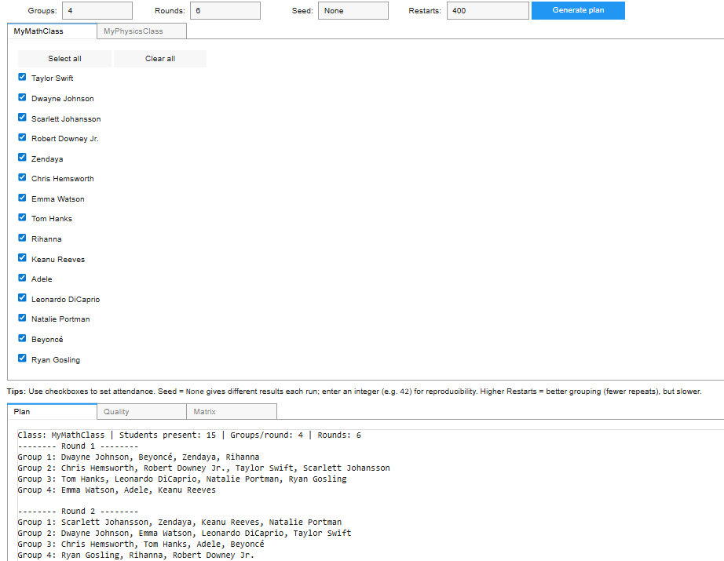
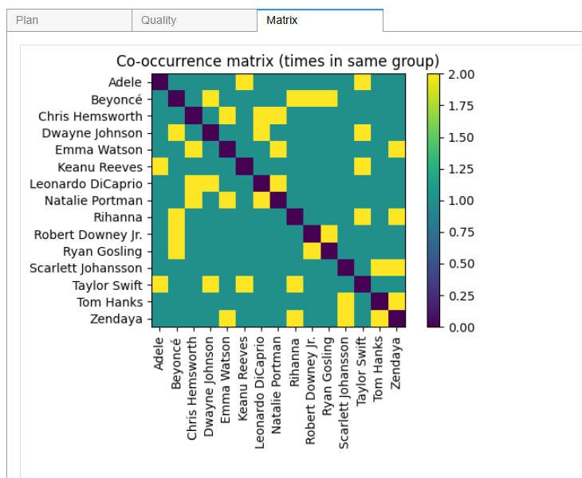
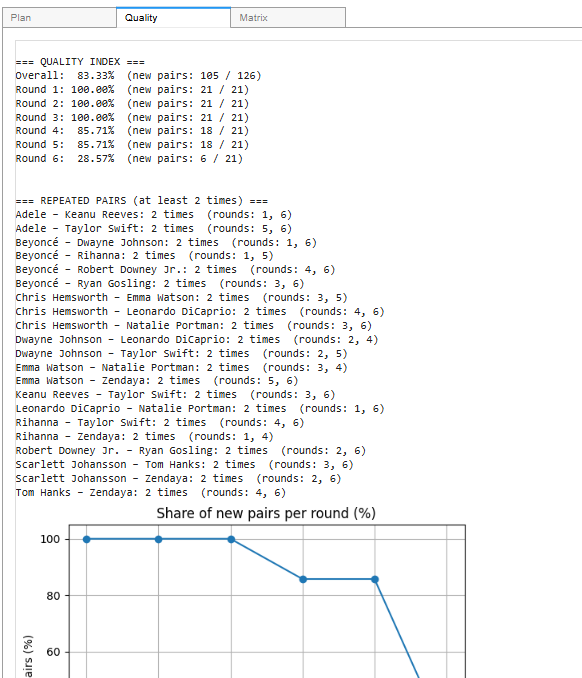

# Random Group Generator

This project provides a simple Python tool for generating random student groups across multiple rounds,  
while minimizing repeated pairings. It is designed for classrooms, workshops, or study sessions.

## Features
- Balances group sizes automatically.  
- Minimizes repeated pairings across rounds.  
- Supports marking students as **present** or **absent** using `[ "Name", 1/0 ]` format.  
- Two modes of use:
  - **Script mode**: Run in terminal as a normal Python script.  
  - **Dashboard mode**: Interactive Jupyter/Colab dashboard with attendance checkboxes, quality metrics, and heatmaps.  

## Usage

### 1. Marking attendance
Each student is defined as a pair:
```python
["Alice", 1],   # 1 = present
["Bob", 0],     # 0 = absent
```
Only students with `1` are included when generating groups.  
In the dashboard, you can tick/untick checkboxes to set attendance interactively.

### 2. Running in terminal
Edit the `ClassA` or `ClassB` lists in the script to match your students, then run:

```bash
python group_generator.py --class ClassA --groups 4 --rounds 2
```

Optional arguments:
- `--class` (default `ClassA`)
- `--groups` number of groups per round (default 4)
- `--rounds` number of rounds (default 2)
- `--seed` random seed for reproducibility (default 42)

### 3. Running in Jupyter / Colab
Use `group_generator_notebook.py` for an interactive dashboard.  
It provides:
- Tabs for each class with student checkboxes for attendance.  
- Automatic schedule generation with one click.  
- Quality metrics (percentage of new vs repeated pairs).  
- Graphs: new pairs per round, repeated pairs per round.  
- Heatmap showing how often each pair of students has been grouped.  

## Example output
```
Class: MyMathClass | Students present: 15 | Groups/round: 4 | Rounds: 6
-------- Round 1 --------
Group 1: Dwayne Johnson, Beyoncé, Zendaya, Rihanna
Group 2: Chris Hemsworth, Robert Downey Jr., Taylor Swift, Scarlett Johansson
Group 3: Tom Hanks, Leonardo DiCaprio, Natalie Portman, Ryan Gosling
Group 4: Emma Watson, Adele, Keanu Reeves
...
```

## Previews

Dashboard in Jupyter/Colab with attendance tabs, quality metrics, and heatmap:

  
*Dashboard overview with attendance checkboxes and controls.*

  
*Quality metrics: share of new vs repeated pairs.*

  
*Heatmap of how often each pair of students was grouped together.*

## License
This project is licensed under the MIT License.
